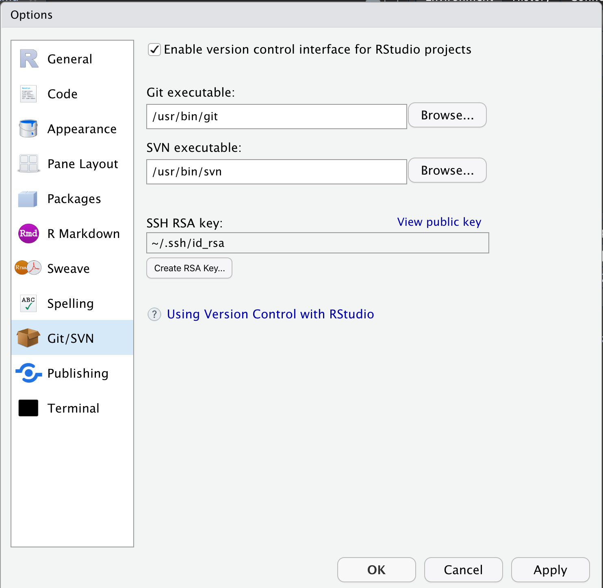

R will be the main computer language we will be using.
We want to make sure we have the right tools installed. There are many
other ways to utilize the R program. I'll present the most common
setup first.


## Setup RStudio

- R 3.6.2
- RStudio 1.2.5033 (Help - About RStudio)
- git client, do not mix up with "github" client

  - Windows: 
    1. git for windows https://git-scm.com/download/win
    2. msys2 (for hard core people) http://www.msys2.org/
  - macOS: 
    there are multiple ways to install `git`
    1. Command Line Tools

        ```bash
        xcode-select --install
        ```

    2. git for mac  https://git-scm.com/download/mac
  - linux / other platforms: do it yourself

  - verify the path to git client at RStudio option

    {width=250px}
- A [GitHub](https://github.com/) account. What is GitHub? It is a centralized location for users to upload project source code. Think of it as DropBox but much better.

- https://happygitwithr.com/ has very good materials on `git` and `github`. (We will come back to this)


## Other R environments

For the sake of consistency and from the point of management, you are required to use RStudio in this course. But certainly, RStudio is not the only way to run R program (at least it is not my way). Here are some of the alternatives.

- Command line:
  - most useful if one need to run R on a remote server via ssh
  - [radian](https://github.com/randy3k/radian) is an alternative to the original R console.
- Editor based environments:
  - VSCode: see [this blog](https://renkun.me/2019/12/26/writing-r-in-vscode-interacting-with-an-r-session/)
  - neovim/ vim: [Nvim-R](https://github.com/jalvesaq/Nvim-R) or via [R languageserver](https://github.com/REditorSupport/languageserver)
  - emacs: [ESS](https://ess.r-project.org/) or via [R languageserver](https://github.com/REditorSupport/languageserver)
- Via Browser:
  - Jupyter notebook/lab (https://jupyter.org/) or JupyterHub (https://jupyterhub.readthedocs.io/en/stable/)
  - RStudio Server https://rstudio.com/products/rstudio/#rstudio-server

## Using git

Refer to https://happygitwithr.com/ Chapter 7 and 9. For authentications, see chapters 10, 11.

## Using git in RStudio

Refer to https://happygitwithr.com/ Chapter 12. Read also section III, IV and V of the book.

