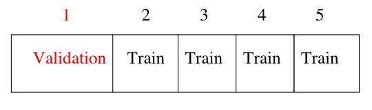
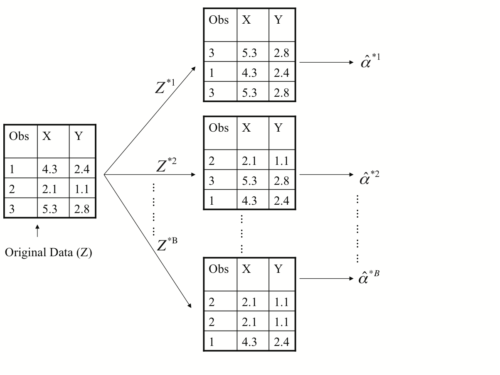
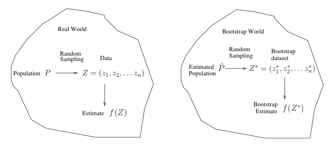

```{r, message = FALSE}
library(tidyverse)
library(rsample)
```


# Resampling methods

- we discuss two resampling methods: cross-validation and the bootstrap.
- these methods refit a model of interest to samples formed from the training set, in order to obtain additional information about the fitted model.
-  For example, they provide estimates of test-set prediction error, and the standard deviation and bias of our parameter estimates


# $K$-fold Cross-validation

- Widely used approach for estimating test error.
- Estimates can be used to select best model, and to give an idea of the test error of the final chosen model.
- Idea is to randomly divide the data into $K$ equal-sized parts. We leave out part $k$, fit the model to the other $K - 1$ parts (combined), and then obtain predictions for the left-out kth
part.
- This is done in turn for each part $k$ and then the results are combined.


```{r echo=FALSE, out.width='80%'}

```


## Details
- Let the $K$ parts be $C_1,\ldots,C_k$, where $C_k$ denotes the indices of the observations in part $k$. There are $n_k$ observations in part $k$.

-  the cross-validation error is
$$
        CV_K = \frac{1}{n} \sum_{k=1}^{K} \sum_{i \in C_k} (y_i - \hat f_{-k}(x_i))^2
$$
where $\hat f_{-k}(x_i)$ is the prediction of $y_i$ based on the data with part $k$ removed.
- if $K = 2$: split-sample cross-validation. Our CV error estimates are going to be biased upwards, because we are only training on half the data each time
- Setting $K = n$ yields $n$-fold or leave-one out cross-validation (LOOCV).

## How to choose $K$

- This is a hard quesiton.
- The choices $K = 5$ or $K = 10$ are pretty much the standards, and people believe that these give good estimates of prediction error, but there is not really any theory supporting this

## A example


```{r}
folds <- vfold_cv(mtcars, 5)
folds %>%
  pull(splits) %>%
  map_dbl(
    ~ {
      train_data <- analysis(.)
      fit <- lm(mpg ~ wt, data = train_data)
      test_data <- assessment(.)
      sum((test_data$mpg - predict(fit, test_data))^2)
    }
  ) %>%
  sum() / nrow(mtcars)
```

# The Bootstrap

- The bootstrap is a flexible and powerful statistical tool that can be used to quantify the uncertainty associated with a given estimator or statistical learning method.
- It can provide an estimate of the standard error of a coefficient, or a confidence interval for that coefficient.

## In the ideal world
 
- For example, we have an estimator $\hat \alpha$ of $\alpha$ and we are interested in its s.d. (to construct confidence interval)
  - $\hat \alpha$ is a function of the observations $(x_i,y_i)$, $i=1,\ldots,n$
  - To estimate the standard deviation of $\hat \alpha$, we could simulate
      observations $(\tilde x_i, \tilde y_i)$, $i=1,\ldots,n$ which have the same distribution as $(x_i,y_i)$.
  - A new estimate of $\alpha$ is obtained, called it $\tilde \alpha$
  - repeat the process 1000 times, we have 1000 $\tilde \alpha$'s and the sample deviations of
    those 1000 $\tilde \alpha$'s can be used to estimate the s.d. of $\hat \alpha$.
    
-  The procedure outlined above cannot be applied, because for real data we cannot generate new samples from the original population.
    
## Now back to the real world

- However, the bootstrap approach allows us to use a computer to mimic the process of obtaining new data sets, so that we can estimate the variability of our estimate without generating additional samples.
- Rather than repeatedly obtaining independent data sets from the population, we instead
        obtain distinct data sets by repeatedly sampling observations from the original data set *with replacement*.
- Each of these 'bootstrap data sets' is created by sampling with replacement, and is the same size as our original dataset. As a result some observations may appear more than once in a given bootstrap data set and some not at all.

## Example with just 3 observations

```{r echo=FALSE, out.width='80%'}

```

## Notations

- Denoting the first bootstrap data set by $Z^{*1}$, we use $Z^{*1}$ to
produce a new bootstrap estimate for $\alpha$, which we call $\hat \alpha^{*1}$
- this procedure is repeated $B$ times for some large value of $B$ (say 100 or 1000)
- we have $B$ different bootstrap data sets, $Z^{*1},\ldots,Z^{*B}$, and $B$
       corresponding $\alpha$ estimates, $\hat \alpha^{*1},\ldots,\hat \alpha^{*B}$
- We estimate the standard error of these bootstrap estimates using the formula
$$
 SE_{B}(\hat \alpha) = \sqrt{\frac{1}{B-1}\sum_{r=1}^{B} (\hat \alpha^{*r} - \bar{\hat
 \alpha}^*)}
$$
where $\bar{\hat \alpha}^*$ is the average of $\hat \alpha^{*r}$'s.

- This serves as an estimate of the standard error of $\hat \alpha$ estimated from the original data set.

       
## A general picture for the bootstrap
```{r echo=FALSE, out.width='100%'}

```

## A example

```{r}
mtcars %>%
  summarize(r = cor(mpg, hp)) %>%
  pull(r)
```

To get the "classical" confidence interval

```{r}
with(mtcars, cor.test(mpg, hp)) %>%
  tidy()
```

Use bootstrap to obtain a confidence interval

```{r}
boots <- bootstraps(mtcars, times = 1000)
```

To get the classical boostrap confidence interval

```{r}
se <- boots %>%
  pull(splits) %>%
  map_dbl(
    ~ {
      train_data <- analysis(.)
      with(train_data, cor(mpg, hp))
    }
  ) %>%
  sd()

with(mtcars, cor(mpg, hp)) + 1.96 * c(-1, 1) * se
```


## Bootstrap Percentile confidence interval

- Primarily used to obtain standard errors of an estimate.
- Also provides approximate confidence intervals for a population parameter.
- Consider the 2.5th and 97.5 percentile of $\hat \alpha^{*1},\ldots,\hat \alpha^{*B}$
- The above interval is called a Bootstrap Percentile confidence interval. It is the simplest method (among many approaches) for obtaining a confidence interval from the bootstrap.
- It usually gives better results for heavily skewed  distributions.

```{r}
boots %>%
  pull(splits) %>%
  map_dbl(
    ~ {
      train_data <- analysis(.)
      with(train_data, cor(mpg, hp))
    }
  ) %>%
  quantile(p = c(0.025, 0.975))
```


## Using `parallel` to do bootstrap

First thing first, we don't want to use `bootstraps()` function for parallel processing because it will make deep copy of the bootstrap datasets. We will do a more primitive resampling using `sample.int`.

```{r}
library(parallel)
cl <- makeCluster(4)
```


```{r}
B <- 1000
clusterEvalQ(cl, {
  # read the data in each worker
  data(mtcars)
  n <- nrow(mtcars)
  NULL
}) %>% invisible()

rs <- parSapply(cl, seq_len(B), function(i) {
  index <- sample.int(n, n, replace = TRUE)
  x <- mtcars$mpg[index]
  y <- mtcars$hp[index]
  cor(x, y)
})

rs %>% quantile(c(0.025, 0.975))
```

```{r}
stopCluster(cl)  # stop the cluster finally
```


## Using `pbdMPI` to do bootstrap


See question 3 of assignment 4.


# Reference

- rsample: https://tidymodels.github.io/rsample/
- Chapter 5 of An Introduction to Statistical Learning http://faculty.marshall.usc.edu/gareth-james/ISL/